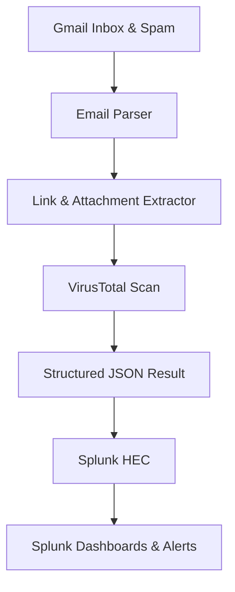

# Email Threat Analysis & SIEM Integration

## Overview
This project demonstrates a **cybersecurity automation pipeline** that monitors and analyzes emails from a Gmail mailbox. Email remains the **#1 attack vector**, so this system provides proactive defense by:

- Automatically detecting malicious **links & attachments**
- Leveraging **VirusTotal threat intelligence**
- Forwarding structured results to **Splunk SIEM** for monitoring and alerting

---

## Components

### 1. Email Access (Gmail IMAP)
- Connects via **IMAP** (Inbox + Spam)
- Requires Gmail IMAP enabled
- Authentication with **Google App Passwords** (not the main password)

### 2. Threat Intelligence (VirusTotal)
- Extracted **URLs & file attachments** are scanned using the **VirusTotal API**
- Supports hash-based and behavioral detection

### 3. SIEM Integration (Splunk HEC)
- Events sent to **Splunk HTTP Event Collector (HEC)** securely
- Configurable endpoint, token, and port (`8088` by default)
- Enables centralized logging, dashboards, and correlation

---

## Project Structure

```

email-threat-automation/
├── send_email.py       # Simulates phishing emails for training/testing
├── main.py             # Core pipeline: monitor inbox, analyze threats, forward to SIEM
├── .env.example        # Example environment configuration
├── requirements.txt    # Python dependencies
└── README.md           # Documentation

````

---

## Environment Configuration

Sensitive credentials are stored in `.env`:

```bash
EMAIL_USER=your_email@gmail.com
EMAIL_PASS=your_app_password
VT_API_KEY=your_virustotal_api_key
SPLUNK_TOKEN=your_splunk_hec_token
SPLUNK_URL=https://yoursplunkserver:8088
````

---

## Scripts

### 🔹 1. Phishing Email Simulation — `send_email.py`

Generates **10 safe, simulated phishing emails** (1 per minute) for testing & training.

**Features:**

* Fake subject lines & links (non-malicious)
* Gmail SMTP auth with App Passwords
* Configurable sender & recipient

https://github.com/OTLAW1899/Automating-Email-Threat-Analysis-SIEM-Integration/commit/bb27aeb56df4876106571aa8dde820046485f5d0

---

### 🔹 2. Email Monitoring & Threat Analysis — `main.py`

The core pipeline retrieves, analyzes, and reports email threats.

**Workflow:**

1. Load `.env` credentials & API keys
2. Connect to Gmail (Inbox + Spam)
3. Retrieve unread emails
4. Parse headers, body, links & attachments
5. Scan URLs/files with VirusTotal
6. Send structured JSON results to Splunk via HEC
7. Repeat every **4 minutes**

---

## Workflow Diagram



---

## Security & Operational Notes

* Gmail: IMAP + App Passwords required
* VirusTotal API → rate limits apply
* Splunk HEC must be enabled & reachable
* Processed emails are tracked to prevent duplicate analysis

---

## Installation

```bash
# 1. Clone the repository
git clone https://github.com/yourusername/email-threat-automation.git
cd email-threat-automation

# 2. Install dependencies
pip install -r requirements.txt

# 3. Configure environment
cp .env.example .env
nano .env   # add your credentials

# 4. (Optional) Send test phishing emails
python send_email.py

# 5. Start monitoring + SIEM integration
python main.py
```

---

## ✅ Use Cases

* Security Awareness Training
* SIEM Integration Testing
* Threat Detection Development
* Automated Email Threat Hunting

---

## Future Enhancements

* AI/NLP-based phishing intent detection
* Sandbox for dynamic attachment execution
* YARA rule integration for signature detection
* Multi-SIEM support (ELK, QRadar, Microsoft Sentinel)
* Docker deployment for scalability

---

## Acknowledgments

* **VirusTotal API** for threat intelligence
* **Splunk HEC** for SIEM integration
* **Streamlit** (planned for dashboards)

---

## Author

**Olatunji Lawal**
*Cybersecurity Analyst*

📅 *15 August 2025*

```


